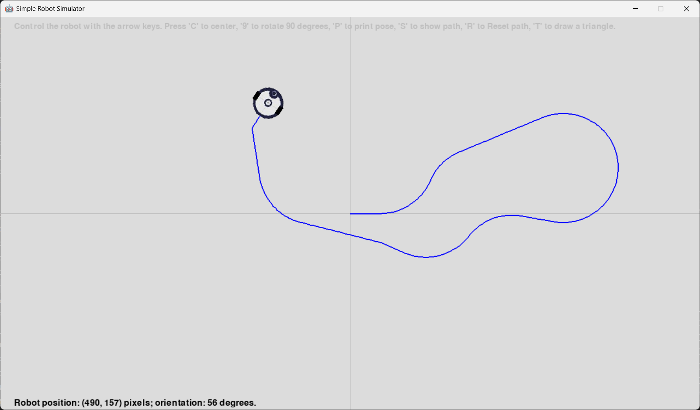

# Simple Robot Simulator

This is a simple robot simulator built using Pygame. For now, the working version of the simulator allows you to control a differential-drive robot on the screen using the keyboard and mouse, and define waypoints for the robot to follow. It also implements simple reaction to obstacle collision. The idea is that you can write your own controller to generate commands to the robot. 

The screenshot below shows the simulator running. You can see a robot, some obstacles in black, some waypoints in red, and the path it followed since the simulation started.



The folder 'under development' contains the version being developed at the moment. It is recommended that you use the files from the main folder.

## Requirements

- Python 3.10 or higher
- Pygame
- NumPy

## Installation

In case you need to install stuff:

1. Install Python 3.10 (or higher) from [python.org](https://www.python.org/).
2. Install Pygame using pip:
    ```
    pip install pygame
    ```
3. Install NumPy using pip:
    ```
    pip install numpy
    ```


## Usage

1. Clone the repository or download the source code.
2. Run the 

open_world_simulator.py

 file:
    ```
    python open_world_simulator.py
    ```

## Controls

When the simulator starts, the robot will be at the center of the screen. With the mouse, click where you want to place the robot. You can further control it with the keyboard or activate the path-following controller for the robot to move across a list of pre-defined waypoints.

While the simulator is running, you can press the following keys to change its behavior:

- **Up/Down Arrow Keys**: Move the robot forward/backwards
- **Left/Right Arrow Keys**: Rotate the robot counterclockwise/clockwise
- **C**: **Center** the robot on the screen
- **9**: rotate the robot by **+90** degrees
- **P**: toggle **Printing** of robot position on the screen
- **S**: toggle **Showing path** on the screen
- **R**: **Reset** the memory of the robot path and achieved waypoints
- **T**: toggle a **Triangle** to indicate the orientation of the robot
- **W**: toggle displaying the **Waypoints** on the screen
- **F**: toggle the controller to **Follow** the path defined by the waypoints
- **Q**: **Quit** the program

## Code Overview

The main components of the code are:

- **Pygame Setup**: Initializes Pygame, sets up the screen, and loads assets.
- **Robot Movement Functions**: Functions to apply linear and angular movement to the robot.
- **Path Follower**: Class that generates angular speed to move the robot across a list of waypoints. 
- **Main Loop**: Handles events, updates the robot's position and orientation, and renders the screen.

## To do

There is a ton of things to do! For now, creating classes to separate the code into independent parts is the priority. The idea is:

* Robot class
    - Have different robot names
	- Combine a profile type with specific sensors and parameters (speed, sensor range etc.)
    - Different profiles for robots 
        - Differential-drive (implemented)
        - Car-like
        - Omnidirectional

* Create a Sensors class
    - IMU
    - LiDAR
    - Wheel encoders
    - IR distance sensors
    - IR for line following
* Sensor Noise class 

* Obstacles class (implemented)
    - Dynamics obstacles
        - Proxemics
        - Potential fields
    - Static obstacles (implemented)

* Grid class (under construction)
    - World parameters

* Planning Algorithms class
    - Dijkstra (under construction)
    - A*
    - D*

* Perception class
    - State estimation 
    - Kalman filters
    - Particle filters
    - SLAM

* Controller class
    - PID to control orientation (implemented in the path follower)
    - Trajectory tracking to control speed and orientation
    - Other simple behaviors

* State machine to select controllers or simple behaviors to:
    - Go-to-goal 
    - Line following
    - Path following
	- Obstacle avoidince
    - Maze solving


## License

This project is licensed under the MIT License. See the LICENSE file for details.

## Acknowledgements

- Praveen K. for teaching me a lot of Python and helping me create this simulator.

---

Feel free to modify and extend the simulator as needed. Enjoy controlling your robot!